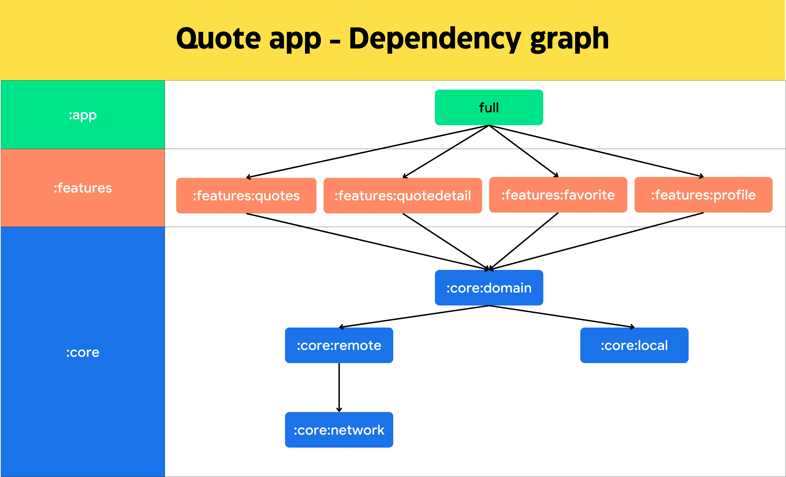
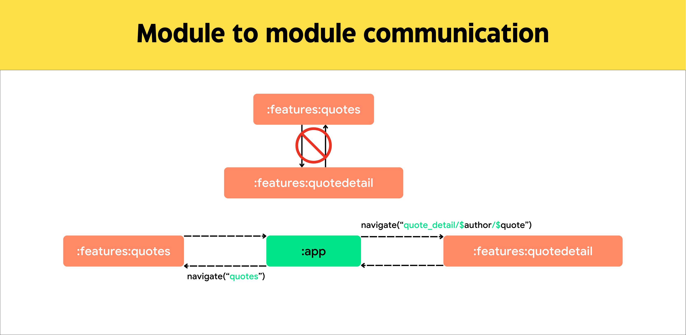

[](https://www.youtube.com/watch?v=W2ml9Dw_FbM)

# Project code structure

```
Quote/                            # Root project directory
├── app/                          # App module
│   ├── ...                       
├── dynamicfeature/               # Dynamic Feature Modules 
│   ├── df1                       # Dynamic feature 1 <- Not yet implemented
│   ├── df2                       # Dynamic feature 2 <- Not yet implemented
├── core/                         # Core/Library Modules
│   ├── common/                   # Common module
│   │   ├── ...                       
│   ├── designsystem/             # Design system module
│   │   ├── ...
│   ├── domain/                   # Domain module
│   │   ├── ...
│   ├── l10n/                     # Localization module
│   │   ├── ...
│   ├── local/                    # Local data module
│   │   ├── ...
│   ├── model/                    # Model module
│   │   ├── ...
│   ├── network/                  # Network module 
│   │   ├── ...
│   ├── remote/                   # Remote data module 
│   │   ├── ...
│   ├── resource/                 # Remote data module 
│   │   ├── ...
├── features/                     # Feature Modules
│   ├── quotes/                   # Quotes module
│   │   ├── ...
│   ├── profile/                  # Profile module
│   │   ├── ...
│   ├── favorite/                 # Favorite module
│   │   ├── ... 
│   ├── quotedetail/              # Quote Detail module
│   │   ├── ...
├── build.gradle.kts              # Build script
├── gradle                        # Build script
│   ├── libs.versions.toml        # Library versions
├── settings.gradle.kts           # Settings script
```
# Dependency Graph



# Module to module communication



# Article

For more information, please refer to the [article](https://medium.com/@anhndt/android-app-modularization-c2b2c4035033).

